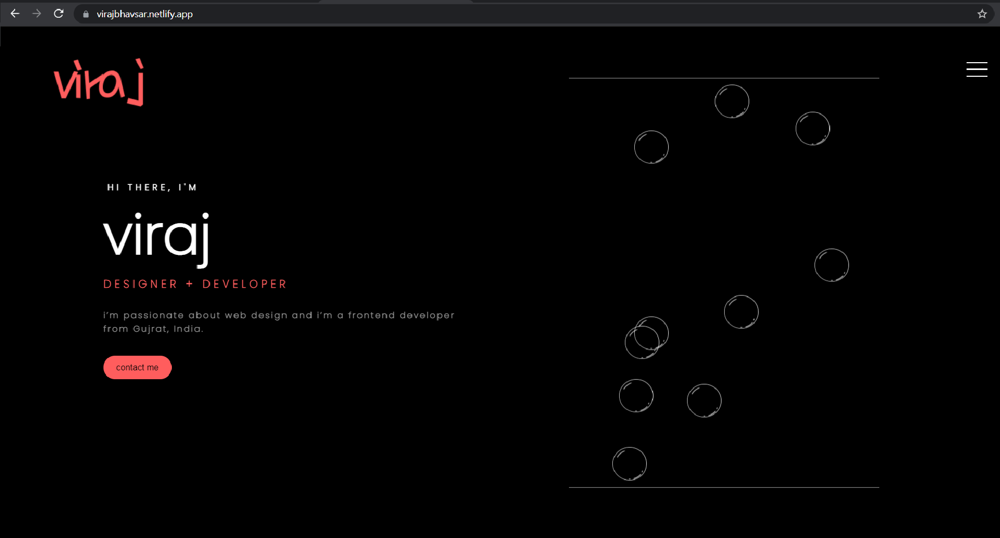

<h1>hey! nice to see you</h1>

##  Welcome to my page!

 My name is Viraj Bhavsar and a software engineer from India, living in Gujarat. 
i'm a full fledged javascript developer 💻
 

## Things I do
<h1>
 

 
 
 

  

 
 

 

 

 

  
</h1>

  
  

#### � student  
#### ⚡ Fun fact: i'm the batman  

## 📫where to find me?
 
<h3><a href="https://virajbhavsar.netlify.app/">open static website</a></h3> 

